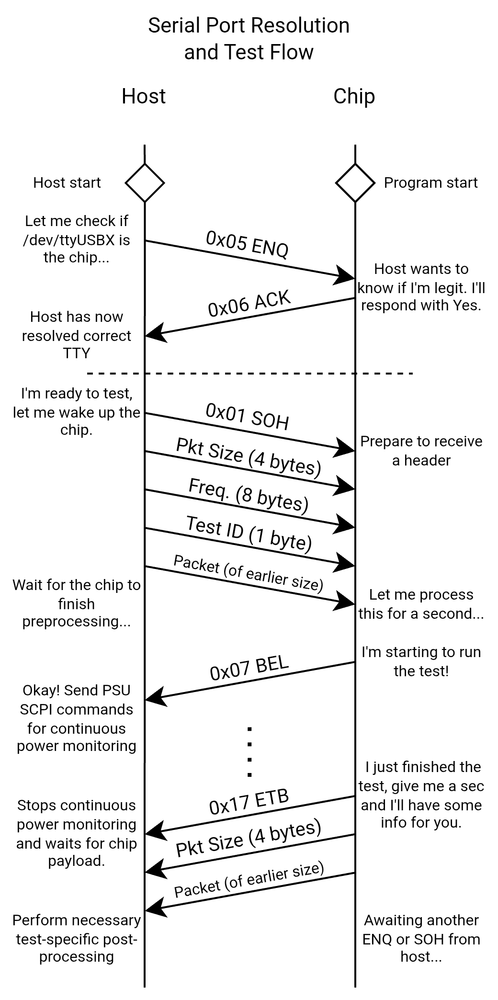

# ShmooTester

This automated testing program performs a sweep across a range of voltages and frequencies based on a supplied plugin for each benchmark you wish to run. In tandem with `libbmark`, this permits a fully automated Shmoo plot generation scheme for any arbitrary benchmark with minimal setup required. 

## Host-Chip Communication Protocol

The ShmooTester relies on a bidirectional UART communication with a program running on the chip for both serial port resolution and running tests. This protocol is implemented using the `libbmark` library within [`dsp24-bmarks`](../dsp24-bmarks/bmark-lib/).

### Serial Port Resolution

Because serial port assignment may vary from device to device and accidental disconnects or reassignments can occur during testing, the tester resolves the appropriate UART serial port through a simple ENQ/ACK procedure. Put simply, the host will send an "enquiry" of 0x05 along a serial port to request an acknowledgment. If this acknowledgment is received within a reasonable amount of time, the host can proceed with the rest of the test flow with the correct UART communication port already established, all without the need for manual trial-and-error.

### Testing Flow

> Note: All multi-byte data is to be sent using **little-endian**.

The testing flow permits disclosure of initial testing data from the host, in addition to final test completion data when the test has finished. When the host is ready to begin a test, the following sequence of data can be sent to the chip (in order from top to bottom):

| Data Type       | Size (bytes) | Description |
| --------------- | ------------ | ----------- |
| Constant SOH (`0x01`)  | 1    | Constant value sent to the chip to signal that the following data should be regarded as the start of a header (SOH) for a host packet. |
| Host Packet Size | 4    | Unsigned 32-bit value representing the size of the data packet to be sent from the host to the chip (in bytes). |
| Frequency (Hz)  | 8    | Unsigned 64-bit value representing the frequency that the test should run at. It should be the chip's job to invoke the necessary PLL register adjustments to achieve this frequency. **Currently, only multiples of 50MHz are supported by `libbmark`**. |
| Test ID  | 1    | The Test ID that you wish to run for the current test executable. |
| Host Packet  | Based on earlier `Host Packet Size` | The initial test setup data to send to the chip. This is useful if you would like to provide a buffer of data for the chip to process for a given test, or if there are other parameters you wish to modify for a specific test (i.e., duration of a test, an address for the test to read/write to, etc.). Currently, `libbmark` stores host packets of 8 bytes or less within the stack within the testing structure, but is still defined during a test run. Any larger host packets will reside on the heap. |

After sending the final byte for the above sequence, benchmarks can perform any necessary pre-processing to set up for a test. When the chip is starting the test, it will send a single-byte `0x07` BEL byte over UART to signal to the host to start capturing power data from the PSU. When the test completes, the chip will send the following sequence of data:

| Data Type       | Size (bytes) | Description |
| --------------- | ------------ | ----------- |
| Constant ETB (`0x17`) | 1    | Constant value sent to the host to signal that the test has completed. As soon as this byte is received, the host will stop capturing power data and await the test's results for correctness. |
| Chip Packet Size | 4    | Unsigned 32-bit value representing the size of the data packet to be sent from the chip to the host (in bytes). |
| Chip Packet  | Based on earlier `Chip Packet Size` | The test completion data to send to the host. Often, this tends to include cycle counts or buffer contents, which can be interpreted and verified in post-processing on the host to ensure that a test completed properly. |

After this payload, the chip will clear out the earlier host packet buffer and await another ENQ or SOH byte from the host for either serial port resolution or a new test run.

This process is summarized in the following diagram:



## Setup

### Python Environment

Create a virtual environment using the package manager of your choice from the provided requirements.txt

For example, using `venv` from the Baremetal repository root:
```sh
python3 -m venv .venv
source .venv/bin/activate
pip install -r tester/requirements.txt
```

### PSU

The PSU will require some preliminary setup to ensure connectivity. Within `utils.py`, edit the following class values within the PSU class:

- **`IDN`**: The IDN for the PSU you are using.
- **`VISA_PATH`**: The GPIB LAN path for the PSU for a remote interface.


## Usage

### Creating a Plugin

To run a new benchmark you must create a new plugin to incorporate it with the ShmooTester. A simple complete example of a plugin can be found in [`plugins/example_plugin.py`](plugins/example_plugin.py).

Within the `plugins/` directory, create a new Python file with a name that suits your new benchmark, and add it to the imports within `__init__.py`. This will include your plugin to be imported upon loading the program. The `timeout` parameter indicates the number of seconds that the host should wait for a response from the chip.

### Designing `ShmooTest` Classes

Every test is represented as an instance of a ShmooTest subclass. Documentation strings are included with the definition of ShmooTest within `utils.py` to describe all methods, though it ultimately boils down to two key methods: `create_payload` and `check_output`:
- `create_payload` generates a payload that we wish to send to the chip and returns two values: a byte array to send, and an object to use for "context" that can be referenced later when verifying the chip payload.
- `check_output` performs a comparison on the chip payload to validate the results. The `context` from the earlier payload generation will be passed back to `check_output` when the chip has sent its results to the host, along with the chip payload located within the `value` parameter. This function returns a tuple containing a boolean status for whether the test passed or failed, as well as a string that will be output to the final test data .TSV file.


 A basic example is provided as follows:

```python
class HelloTest(ShmooTest):

    def create_payload(self):
        return b'Hey, Chip!', {}
    
    def check_output(self, context, value):
        return value == b'Hello World!', value
```

> Note: If you find that you have a test that matches this similar simple functionality, you can also use the built-in `ShmooConstantTest` subclass, which works for known constant input and output values:
> ```py
> ShmooConstantTest("Hello World Test", 0x1,
>                   to_chip=b'Hello, Chip!',
>                   expect=b'Hello World!'),
> ```

This `HelloTest` class implements a common simple functionality for a straightforward `Hello World!` benchmark. Here, our context is empty, so there isn't much purpose here, but if you have a test where the output depends on the host payload that you sent to the chip, you can include arbitrary Python values within the context object to be passed back to `check_output` later on. If your context value happens to be a dictionary, the tester will automatically populate a `chip_freq` key with the frequency (in Hz) that the test was instructed to run at before calling `check_output`.

Because a single executable may have multiple tests, we must group all of our `ShmooTest` subclass instances into a single `TestSuite`, which gets associated with a particular binary executable. The `TestSuite` instantiation is a variadic function, which takes in all available tests to associate with the executable. We can then register the `TestSuite` instance with the `ShmooTestHarness`, which acts as a wrapper for all benchmarking functionality:

```python
ShmooTestHarness.register_test_suite(TestSuite("hello",
    "build/dsp24-bmarks/path/to/your/binary.elf",
    HelloTest("Hello World Test", 0x1)
))
```

This will register a test suite with the name `hello` assigned to the ELF file provided. A `HelloTest` has been created with Test ID 1, which will run when executing the full `hello` test suite.

We can verify that our test suite was registered properly by running the following command:

```sh
$ ./tester/tester.py -l

INFO:utils:Registered test suites:
INFO:utils:     hello (1 tests)
INFO:utils:             Hello World Test (Test ID: 1 [0x1])
```

We can see our new test suite and `HelloTest` listed, which means that it is properly registered for use. If we wish to debug the host payload generation process, we can check the packet that would be sent by running the following mock testing command:

```sh
$ ./tester/tester.py -s hello -m

INFO:utils:--- Running potential outputs for suite "hello" ---
INFO:utils:Test "Hello World Test" (Test ID: 1 [0x1])
INFO:utils:     Host-to-Chip Payload: b'Hey, Chip!'
INFO:utils:     Host-to-Chip Payload Size: 10
INFO:utils:     Generated Context Object {}
```

### Extending `ShmooTest` for Custom Functionality

If you wish to implement more sophisticated functionality for your benchmarks, you can also extend the `__init__` function to include more parameters. For example, the following class implements functionality to potentially support signaling to the chip to run a test with multiple cores and a duration to run the test:

```python
class TimedMultiCoreTest(ShmooTest):

    def __init__(self, name, harts, runtime, *args, timeout=5, **kwargs):
        # Use number of harts as the test ID.
        super().__init__(name, harts, *args, timeout=timeout, **kwargs)
        self.runtime = runtime
        self.harts = harts

    def create_payload(self):
        """
        Creates a payload of the form b'<runtime in ms><HARTs>'
        """
        runtime_bytes = self.runtime.to_bytes(4, byteorder='little')
        harts_bytes = self.harts.to_bytes(1, byteorder='little')
        return runtime_bytes + harts_bytes, {}
    
    def check_output(self, context, value):
        return True, f'{self.harts} cores at {self.runtime} ms'

...

ShmooTestHarness.register_test_suite(TestSuite("my_test",
    "build/dsp24-bmarks/path/to/binary.elf",
    TimedMultiCoreTest("My Test with 1 Core", harts=1, runtime=2000),
    TimedMultiCoreTest("My Test with 2 Cores", harts=2, runtime=2000),
    TimedMultiCoreTest("My Test with 3 Cores", harts=3, runtime=2000),
    TimedMultiCoreTest("My Test with 4 Cores", harts=4, runtime=2000),
    TimedMultiCoreTest("Super Long 4 Core Test", harts=4, runtime=10000, timeout=14),
))
```

With this definition, if we wanted to run a test with only 2 cores, we can use:

```sh
$ ./tester/tester.py -s my_test -t 2
```

> **Note:** By default, this assumes that you want to run a test on DSP24. For other chips, you can specify the `-c` flag with the driver name of that chip. For example, if you want to run the same test on BearlyML'24, you can use:
> ```sh
> $ ./tester/tester.py -c bearly24 -s my_test -t 2
> ```

### Real-Time Debugging

The ShmooTester includes built-in live debugging capabilities to allow you to step through the entire test flow using an external debugger using the `-d` flag. When this flag is specified, the user will be prompted to confirm each action that the ShmooTester completes along the testing flow prior to its execution. Specifically, the user will be prompted about the following actions:

- Prior to the PSU output being enabled.
- Prior to resetting and programming the chip (if the `--no-upload` or `-n` flag is not specified).
- Prior to attempting an ENQ/ACK-verified UART connection.
  - Note: This step requires a running program on the chip side, at least at the point of awaiting a command on the `init_test` side.
- Prior to sending the host payload to the chip over UART.

Timeouts for a chip payload will be overridden to be one year (infinity) to allow for on-chip debugging while the host waits for a response.

A typical workflow with this command would be to use it in tandem with the `--no-upload` or `-n` flag, which disables uploading and resetting the chip, alongside using an external OpenOCD and GDB session. When the host is waiting to attempt an ENQ/ACK UART connection, use a separate GDB instance to manually allow the program to execute `init_test`. Then, the host payload can be sent from the host manually, triggering a custom breakpoint within your benchmark:

<pre><code>$ ./tester/tester.py -s hello -d -n --no-psu
Please confirm the following parameter sweep:
Voltages: [0.85]
Frequencies: [100 150]
PSU Source Settings: 2-Wire Local Sensing Mode (Channel 1)
Dummy PSU (Log Redirect): True (SCPI commands will be redirected to a log. No power data will be collected.)
Debugging Mode Enabled
 (y/n): y
INFO:utils:--- Starting enumeration for test suite "hello" ---
INFO:utils:[Dummy PSU] Dummy PSU has been created.
INFO:utils:[Dummy PSU] QUERY: *IDN?
INFO:utils:[Dummy PSU] QUERY: DISP:VIEW METER3
INFO:utils:[Dummy PSU] QUERY: VOLT:SENS:SOUR INT,(@1)
INFO:utils:[Misc] Output will be stored within "..."
INFO:utils:--- [Test ID 1] Running at 100 MHz and 0.85 V ---
<b>[DBG] Press Enter to set PSU limits and enable PSU.</b>
INFO:utils:[Dummy PSU] QUERY: APPL Ch1, 0.85, 2
INFO:utils:[Dummy PSU] QUERY: VOLT:PROT 1.5, (@1)
INFO:utils:[Dummy PSU] QUERY: OUTP ON,(@1)
INFO:utils:[Misc] No Upload is True, skipping chip programming step.
<b>[DBG] Press Enter to attempt ENQ/ACK-verified UART connection (Program needs to be within init_test for this to work).</b>
</code></pre>

### Output Folder Structure

The ShmooTester generates multiple files as output collateral, each containing varying pieces of information about the test:

```
data_<suite name>_<ISO8601 datetime of test start>/
├─ result.tsv
├─ test_<test id>_<voltage>v_<frequency in MHz>MHz.csv
├─ ...
├─ test_<test id>_plot.png
```

#### result.tsv

The `result.tsv` file contains all summary data from each test run, including pass/fail statuses:

| Column Name     | Description |
| --------------- | ----------- |
| Suite Name      | The name of the suite. |
| Test Name       | The name of the test run. |
| Test ID         | The test ID that was run. |
| Voltage         | The voltage (V) that was set to the PSU. |
| Frequency       | The frequency (Hz) that the test was instructed to run at. |
| Status          | The status of the test, `PASS` if the test passed, otherwise failure. |
| Context         | Serialized value of the context that was generated by the associated ShmooTest's create_payload method. |
| Compare Check Data | The second value returned by the associated ShmooTest's `check_output` method. |

#### test_Xv_XMHz.csv

Contains raw data output from the PSU:

| Column Name     | Description |
| --------------- | ----------- |
| Voltage         | Voltage (V) reported by the PSU over GPIB. |
| Timestamp       | Estimated timestamp (s) generated by the host assuming a constant delay between measurements. |
| Current         | Current (A) reported by the PSU over GPIB. |

#### test_X_plot.png

The Shmoo plot output by the ShmooTester after all runs have completed.

## Examples

All commands should be run from the Baremetal IDE repository root directory.


### List test suites
If you want to list all of the registered test suites and their associated tests, you may use the following command:
```sh
$ ./tester/tester.py -l

INFO:utils:Registered test suites:
INFO:utils:     hello (1 tests)
INFO:utils:             Hello World Test (Test ID: 1 [0x1])
INFO:utils:     memcpy (4 tests)
INFO:utils:             CPU memcpy (Test ID: 0 [0x0])
INFO:utils:             GCC memcpy (Test ID: 1 [0x1])
INFO:utils:             RVV memcpy (Test ID: 2 [0x2])
INFO:utils:             DMA memcpy (Test ID: 3 [0x3])
INFO:utils:     saturn_pvirus_1h (1 tests)
INFO:utils:             Saturn Power Virus (Test ID: 0 [0x0])
INFO:utils:     saturn_pvirus_2h (1 tests)
INFO:utils:             Saturn Power Virus (Test ID: 0 [0x0])
INFO:utils:     saturn_pvirus_3h (1 tests)
INFO:utils:             Saturn Power Virus (Test ID: 0 [0x0])
INFO:utils:     saturn_pvirus_4h (1 tests)
INFO:utils:             Saturn Power Virus (4 cores) (Test ID: 0 [0x0])
INFO:utils:     conv_pvirus (1 tests)
INFO:utils:             1D Convolution Power Virus (Test ID: 0 [0x0])
```

### Sweep all tests in a test suite for a voltage and frequency range

> Note: If a PSU sensing mode is not specified using `--psu-mode`, it will default to 2-wire internal sensing mode. Voltage sweep settings default to support stepping by 0.05V.

To run the `saturn_pvirus_1h` test suite while sweeping voltage from 0.55V to 1.1V at 0.05V increments and sweeping PLL frequency from 50 MHz to 1.3GHz, you can use the following command:

```sh
$ ./tester/tester.py -s saturn_pvirus_1h --min-v 0.55 --max-v 1.11 --step-v 0.05 --min-freq 50 --max-freq 1301
```

After the run has completed, data will be output to a directory named `data_<suite_name>_<ISO8601 datetime of test start>`.

### Run a full test suite at a single frequency without a PSU connection

The following command runs all tests in the `memcpy` test suite at 100MHz using a dummy PSU.

```sh
$ ./tester/tester.py -s memcpy --min-freq 100 --max-freq 101 --no-psu
```

### Generate a Shmoo plot from an earlier test run

```sh
$ ./tester/tester.py -s saturn_pvirus_1h -i <path to output data folder>
```

The plot(s) will be generated as `test_<test id>_plot.png` within the folder, overwriting any existing plots.

## CLI Reference
```
usage: Jasmine's ShmooTester [-h] [-i INPUT] [-o OUTPUT] [-c CHIP] [-s SUITE] [-t TESTS] [--min-v MIN_V] [--max-v MAX_V] [--step-v STEP_V] [--min-freq MIN_FREQ] [--max-freq MAX_FREQ] [--step-freq STEP_FREQ] [--max-v-fail MAX_V_FAIL] [--retries RETRIES] [-r NUM_RUNS] [-f] [--psu-mode {INT,EXT}]
                             [--psu-channel PSU_CHANNEL] [--no-psu] [-m] [-d] [-n] [-l] [--log {DEBUG,INFO,WARNING,ERROR,CRITICAL}] [--logfile LOGFILE]

Performs Shmoo testing using the default BEL/ETB Bringup communication protocol.

optional arguments:
  -h, --help            show this help message and exit
  -i INPUT, --input INPUT
                        Path to an existing Shmoo test run to import for Shmoo plot generation. If specified, this will only generate a Shmoo plot from existing data and not run any tests.
  -o OUTPUT, --output OUTPUT
                        Path for storing output files. If the path does not already exist, it will be created. If unspecified, a default path containing the suite name and test start timestamp will be created.

Shmoo Testing Options:
  -c CHIP, --chip CHIP  Chip to run the test on. This is used to locate a configuration file with the path `./platform/chipname/chipname.cfg`. Defaults to `dsp24`.
  -s SUITE, --suite SUITE
                        Name of the test suite to run
  -t TESTS, --test TESTS
                        ID of the test you wish to run (as a decimal number). This argument can be passed multiple times to run multiple specific tests within a test suite. If unspecified, all tests will run.
  --min-v MIN_V         Voltage lower bound
  --max-v MAX_V         Voltage upper bound (exclusive)
  --step-v STEP_V       Voltage step size
  --min-freq MIN_FREQ   Frequency lower bound (in MHz)
  --max-freq MAX_FREQ   Frequency upper bound (in MHz, exclusive)
  --step-freq STEP_FREQ
                        Frequency step size (in MHz)
  --max-v-fail MAX_V_FAIL
                        Maximum number of consecutive failures until the tester changes to a new voltage.
  --retries RETRIES     Maximum number of retries permitted for a single frequency test at a given voltage. Retries are disabled (0) by default.
  -r NUM_RUNS, --num-runs NUM_RUNS
                        Number of times to re-run the test for a given attempt. Only the final test run will have data captured. Any fail within these runs will fall back to the specified `attempts` count. Defaults to 1.
  -f, --force           Force start without a confirmation of limits. Only use this setting if you are absolutely sure that the testbench setup is correct and you are aware of the assigned limits.

PSU Configuration Options:
  --psu-mode {INT,EXT}  Mode to set the PSU to sense with. `EXT` for 4-wire remote sense, `INT` for 2-wire local sense. Defaults to INT.
  --psu-channel PSU_CHANNEL
                        Channel to use for the PSU (1-3). Defaults to 1.
  --no-psu              Disables sending any commands to the PSU and instead redirects all SCPI commands to the log.

Debugging Options:
  -m, --mock-test       Only mock run the host payload creation function of a test suite
  -d, --debug           Enables debugging mode, disabling all serial timeouts and allowing the user to run through a Shmoo test step-by-step.
  -n, --no-upload       Disables OpenOCD reset and program of the chip. Useful for debugging with an external OpenOCD+GDB configuration.
  -l, --list-suites     Ignore all other commands and print a list of test suites

Logging Options:
  --log {DEBUG,INFO,WARNING,ERROR,CRITICAL}
                        Set the logging level
  --logfile LOGFILE     Path to an optional log file for terminal capture. If this setting is used, STDOUT will only be used for user prompts.

Created by Jasmine Angle (angle@berkeley.edu)
```
